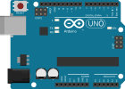
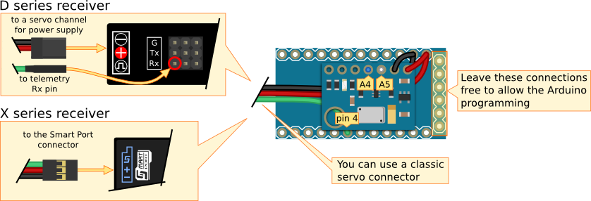
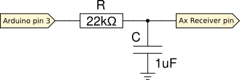

# Building an openXsensor Alti / Vario #

## Disclaimer ##

Authors do not provide any warranty whatsoever for the instructions below. Do it at your own risk. Read and understand all of the information below before you begin.

## Stuff you will need (bill of material) ##

  * An accurate multimeter.

  * A compatible Arduino board :

> - [Arduino Uno](http://arduino.cc/en/Main/ArduinoBoardUno) (maybe a little big to put in a plane but useful for testing ;)).

> 

> - [Arduino Nano](http://arduino.cc/en/Main/ArduinoBoardNano)

> 

> - Arduino Pro Mini (ATmega328 only)  [5V-16MHz](https://www.sparkfun.com/products/11113) and [3.3V-8MHz](https://www.sparkfun.com/products/11114) that you can find nearly everywhere.

>  -  ...

  * A FTDI cable for programming the Arduino Pro Mini (e.g. FTDI Basic) that provides the DTR connector to auto reset the arduino.

>  ...

  * A MS5611 based sensor board (type "MS5611" in your favourite web search engine).

>  ...

  * A 2pin 2.54mm header (to easily mount the more common MS5611 board).

  * Electrical cables / servo cable extension.

  * A FrSky telemetry capable receiver with a sensor port or alternatively one free analog input signal (A1 or A2) to transfer the lift/sink rate:
    * D series : D8R-x, D4R-II, D6FR
    * X series : X8R, X6R, X4R

---

# Connecting the Arduino to the MS5611 and the receiver #

## Power supply considerations ##

**WARNING:** make sure you are using only one power source at a time for the Arduino. If you connect the Arduino to the PC, always disconnect any other power supply first!

As a general rule, to guarantee proper operation of the Arduino MCU, the power supply must be as stable as possible.

In our RC applications, powering comes from batteries or BEC circuitry which are subject to variations, batteries discharge and BEC voltage can drop under high loads (servos activity).

Fortunately, Arduino  boards are equipped with a voltage regulator, but for them to work correctly, you have to follow some recommended ranges:
  * 5V 16MHz Arduino Pro Mini: voltage applied to the RAW connector >> 5.2V to 12V
  * 3.3V 8MHz Arduino Pro Mini: voltage applied to the RAW connector >> 3.5V to 12V

Under these values, the regulator do not regulate anymore and lets the voltage through.

If you don't measure analog values (only variometer without the RC remote or Analog climb rate options), it should not be a problem up to the following absolute safe minimum values:
  * 3.78V for the 5V 16MHz Arduino Pro Mini
  * 3.3V for the 3.3V 8MHz Arduino Pro Mini because you also have to power the MS5611 board

**In short:**
  * 1 cell lipo power source >> 3.3v Arduino Pro Mini
  * From ~5V power source >> 5v Arduino Pro Mini

---

## General connection diagram ##

---

## Convenient mounting example ##

---

## With optional PPM Input from servo port ##

More information on this option: **[Vario RC remote sensitivity](OXS_Conf_Vario#RC_remote_sensitivity.md)**

---

## With optional analog climb rate output ##

More information on this option: **[Vario Analog climb rate](OXS_Conf_Vario#Analog_climb_rate)**
Before you connect pin 3 (or 11) of the Arduino to the receiver Ax pin, you need an electronic filter to convert the PWM signal to an analog DC voltage:

It's just 2 simple components:

  * a 22kOhm resistor
  * a 1uF capacitor

These values have been chosen to get a good compromise between low voltage ripple and low response time.

_Further details on this subject: http://provideyourown.com/2011/analogwrite-convert-pwm-to-voltage/_

---

# General recommendations #

  * don't expose the MS5611 pressure sensor to direct light
  * try to put OXS away from air flow, it needs static pressure
  * use some sort of cover (shrink wrap...)
  * don't forget to **[configure OXS](OXS_Configuration)** !

---

# Programming the Arduino #

Below, you'll find some great resources about the Arduino Pro Mini programming:

  * http://arduino.cc/en/Guide/ArduinoProMini

  * https://learn.sparkfun.com/tutorials/using-the-arduino-pro-mini-33v

---

# To go further in the thermal hunting #

If you want to maximize the vario efficiency, you can use a Total Energy (TE) probe, more information on the links below:

  * http://openrcforums.com/forum/viewtopic.php?f=86&t=5856#p83775

  * http://voiletech.free.fr/skyassistant/energie_totale.htm

---
